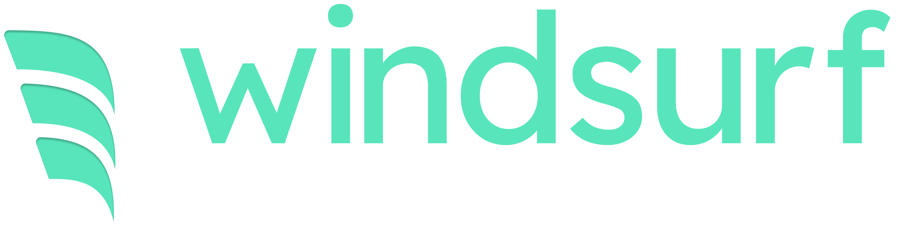

<p align="center">
  
</p>

---

[](https://discord.gg/3XFf78nAx5)
[](https://twitter.com/intent/follow?screen_name=windsurf_ai)

[](https://docs.windsurf.com)
[](https://windsurf.canny.io/feature-requests/)
[](https://windsurf.com?repo_name=exafunction%2Fwindsurf.vim)

[](https://marketplace.visualstudio.com/items?itemName=Codeium.codeium)
[](https://plugins.jetbrains.com/plugin/20540-codeium/)
[](https://open-vsx.org/extension/Codeium/codeium)
[](https://chrome.google.com/webstore/detail/codeium/hobjkcpmjhlegmobgonaagepfckjkceh)

# windsurf.vim

_Free, ultrafast Copilot alternative for Vim and Neovim_

Windsurf autocompletes your code with AI in all major IDEs. We [launched](https://www.windsurf.com/blog/codeium-copilot-alternative-in-vim) this implementation of the Windsurf plugin for Vim and Neovim to bring this modern coding superpower to more developers. Check out our [playground](https://www.windsurf.com/playground) if you want to quickly try out Windsurf online.

Contributions are welcome! Feel free to submit pull requests and issues related to the plugin.

<br />


<br />

## 🚀 Getting started

1. Install [Vim](https://github.com/vim/vim) (at least 9.0.0185) or [Neovim](https://github.com/neovim/neovim/releases/latest) (at
   least 0.6)

2. Install `Exafunction/windsurf.vim` using your vim plugin manager of
   choice, or manually. See [Installation Options](#-installation-options) below.

3. Run `:Codeium Auth` to set up the plugin and start using Windsurf.

You can run `:help codeium` for a full list of commands and configuration
options, or see [this guide](https://www.windsurf.com/vim_tutorial) for a quick tutorial on how to use Windsurf.

## 🛠️ Configuration

For a full list of configuration options you can run `:help codeium`.
A few of the most popular options are highlighted below.

### ⌨️ Keybindings

Windsurf provides the following functions to control suggestions:

| Action                       | Function                       | Default Binding |
| ---------------------------  | ------------------------------ | --------------- |
| Clear current suggestion     | `codeium#Clear()`              | `<C-]>`         |
| Next suggestion              | `codeium#CycleCompletions(1)`  | `<M-]>`         |
| Previous suggestion          | `codeium#CycleCompletions(-1)` | `<M-[>`         |
| Insert suggestion            | `codeium#Accept()`             | `<Tab>`         |
| Manually trigger suggestion  | `codeium#Complete()`           | `<M-Bslash>`    |
| Accept word from suggestion  | `codeium#AcceptNextWord()`     | `<C-k>`         |
| Accept line from suggestion  | `codeium#AcceptNextLine()`     | `<C-l>`         |

Windsurf's default keybindings can be disabled by setting

```vim
let g:codeium_disable_bindings = 1
```

or in Neovim:

```lua
vim.g.codeium_disable_bindings = 1
```

If you'd like to just disable the `<Tab>` binding, you can alternatively
use the `g:codeium_no_map_tab` option.

If you'd like to bind the actions above to different keys, this might look something like the following in Vim:

```vim
imap <script><silent><nowait><expr> <C-g> codeium#Accept()
imap <script><silent><nowait><expr> <C-h> codeium#AcceptNextWord()
imap <script><silent><nowait><expr> <C-j> codeium#AcceptNextLine()
imap <C-;>   <Cmd>call codeium#CycleCompletions(1)<CR>
imap <C-,>   <Cmd>call codeium#CycleCompletions(-1)<CR>
imap <C-x>   <Cmd>call codeium#Clear()<CR>
```

Or in Neovim (using [wbthomason/packer.nvim](https://github.com/wbthomason/packer.nvim#specifying-plugins) or [folke/lazy.nvim](https://github.com/folke/lazy.nvim)):

```lua
-- Remove the `use` here if you're using folke/lazy.nvim.
use {
  'Exafunction/windsurf.vim',
  config = function ()
    -- Change '<C-g>' here to any keycode you like.
    vim.keymap.set('i', '<C-g>', function () return vim.fn['codeium#Accept']() end, { expr = true, silent = true })
    vim.keymap.set('i', '<c-;>', function() return vim.fn['codeium#CycleCompletions'](1) end, { expr = true, silent = true })
    vim.keymap.set('i', '<c-,>', function() return vim.fn['codeium#CycleCompletions'](-1) end, { expr = true, silent = true })
    vim.keymap.set('i', '<c-x>', function() return vim.fn['codeium#Clear']() end, { expr = true, silent = true })
  end
}
```

(Make sure that you ran `:Codeium Auth` after installation.)

### ⛔ Disabling Windsurf

Windsurf can be disabled for particular filetypes by setting the
`g:codeium_filetypes` variable in your vim config file (vimrc/init.vim):

```vim
let g:codeium_filetypes = {
    \ "bash": v:false,
    \ "typescript": v:true,
    \ }
```

Windsurf is enabled by default for most filetypes.

You can also _disable_ codeium by default with the `g:codeium_enabled` variable,
and enable it manually per buffer by running `:CodeiumEnable`:

```vim
let g:codeium_enabled = v:false
```

or in Neovim:

```lua
vim.g.codeium_enabled = false
```

Or you can disable codeium for _all filetypes_ with the `g:codeium_filetypes_disabled_by_default` variable,
and use the `g:codeium_filetypes` variable to selectively enable codeium for specified filetypes:

```vim
" let g:codeium_enabled = v:true
let g:codeium_filetypes_disabled_by_default = v:true

let g:codeium_filetypes = {
    \ "rust": v:true,
    \ "typescript": v:true,
    \ }
```

If you would like to just disable the automatic triggering of completions:

```vim
let g:codeium_manual = v:true

" You might want to use `CycleOrComplete()` instead of `CycleCompletions(1)`.
" This will make the forward cycling of suggestions also trigger the first
" suggestion manually.
imap <C-;> <Cmd>call codeium#CycleOrComplete()<CR>
```

To disable automatic text rendering of suggestions (the gray text that appears for a suggestion):

```vim
let g:codeium_render = v:false
```

### Show Windsurf status in statusline

Windsurf status can be generated by calling the `codeium#GetStatusString()` function. In
Neovim, you can use `vim.api.nvim_call_function("codeium#GetStatusString", {})` instead.
It produces a 3 char long string with Windsurf status:

- `'3/8'` - third suggestion out of 8
- `'0'` - Windsurf returned no suggestions
- `'*'` - waiting for Windsurf response

In normal mode, status shows if Windsurf is enabled or disabled by showing
`'ON'` or `'OFF'`.

In order to show it in status line add following line to your `.vimrc`:

```set statusline+=\{…\}%3{codeium#GetStatusString()}```

Shorter variant without Windsurf logo:

```set statusline+=%3{codeium#GetStatusString()}```

Please check `:help statusline` for further information about building statusline in VIM.

vim-airline supports Windsurf out-of-the-box since commit [3854429d](https://github.com/vim-airline/vim-airline/commit/3854429d99c8a2fb555a9837b155f33c957a2202).

### Launching Windsurf Chat

Calling the `codeium#Chat()` function or using the `Codeium Chat` command will enable search and indexing in the current project and launch Codeium Chat in a new browser window.

```vim
:call codeium#Chat()
:Codeium Chat
```

The project root is determined by looking in Vim's current working directory for some specific files or directories to be present and goes up to parent directories until one is found.  This list of hints is user-configurable and the default value is:

```let g:codeium_workspace_root_hints = ['.bzr','.git','.hg','.svn','_FOSSIL_','package.json']```

Note that launching chat enables telemetry.

## 💾 Installation Options

### 💤 Lazy

```lua
{
  'Exafunction/windsurf.vim',
  event = 'BufEnter'
}
```

### 🔌 vim-plug

```vim
Plug 'Exafunction/windsurf.vim', { 'branch': 'main' }
```

### 📦 Vundle

```vim
Plugin 'Exafunction/windsurf.vim'
```

### 📦 packer.nvim:

```vim
use 'Exafunction/windsurf.vim'
```

### 💪 Manual

#### 🖥️ Vim

Run the following. On windows, you can replace `~/.vim` with
`$HOME/vimfiles`:

```bash
git clone https://github.com/Exafunction/windsurf.vim ~/.vim/pack/Exafunction/start/windsurf.vim
```

#### 💻 Neovim

Run the following. On windows, you can replace `~/.config` with
`$HOME/AppData/Local`:

```bash
git clone https://github.com/Exafunction/windsurf.vim ~/.config/nvim/pack/Exafunction/start/windsurf.vim
```
